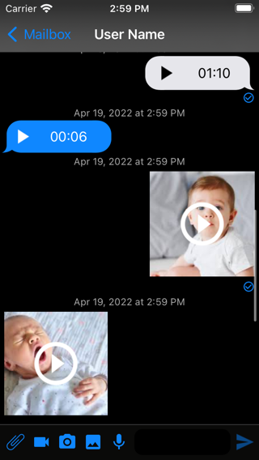
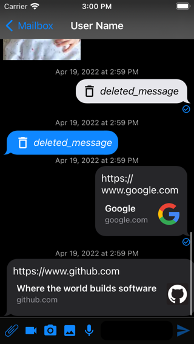

# ChatLib

[](https://travis-ci.org/Asmaa Kohla/ChatLib)
[](https://cocoapods.org/pods/ChatLib)
[](https://cocoapods.org/pods/ChatLib)
[](https://cocoapods.org/pods/ChatLib)


<p align="center"> 
 
 
 
</p> 

## Example

To run the example project, clone the repo, and run `pod install` from the Example directory first.

## Requirements

## Installation

ChatLib is available through [CocoaPods](https://cocoapods.org). To install
it, simply add the following line to your Podfile:

```ruby
pod 'ChatLib'
```

## Author

Asmaa Kohla, asmaa.kohla@gmail.com

## License

ChatLib is available under the MIT license. See the LICENSE file for more info.
